# About Me

!!! info "Welcome"
    I'm a DevOps enthusiast passionate about automation, infrastructure as code, and continuous integration/deployment practices. This documentation site serves as both a personal knowledge base and a resource for others in the DevOps community.

!!! info "Welcome"
    I'm a DevOps Architect and Systems Administrator based in New Delhi, India, with a strong background in Kubernetes, CI/CD, and infrastructure management. My expertise lies in building and maintaining scalable, secure, and automated cloud-native environments.

## Professional Focus

```mermaid
%%{init: {'theme': 'base', 'themeVariables': { 'fontSize': '16px', 'fontFamily': 'arial' }, 'securityLevel': 'loose', 'zoom': 1.5 }}%%
graph TD
    A[DevOps] --> B[Containers]
    A --> C[Infrastructure]
    A --> D[Automation]
    A --> E[Security]
    A --> F[Monitoring]
    
    B --> B1[Kubernetes]
    B --> B2[Docker]
    B --> B3[Container Security]
    
    C --> C1[High Availability]
    C --> C2[Distributed Storage]
    C --> C3[Load Balancing]
    
    D --> D1[CI/CD Pipelines]
    D --> D2[IaC]
    D --> D3[GitOps]
    
    E --> E1[SSO Integration]
    E --> E2[Certificate Management]
    E --> E3[Access Control]
    
    F --> F1[Prometheus]
    F --> F2[Grafana]
    F --> F3[UptimeKuma]

    style A fill:#f9f,stroke:#333,stroke-width:3px,text-align:center,width:200px,height:60px
    style B fill:#bbf,stroke:#333,stroke-width:2px,width:180px
    style C fill:#bbf,stroke:#333,stroke-width:2px,width:180px
    style D fill:#bbf,stroke:#333,stroke-width:2px,width:180px
    style E fill:#bbf,stroke:#333,stroke-width:2px,width:180px
    style F fill:#bbf,stroke:#333,stroke-width:2px,width:180px
```

## Core Competencies

=== "Infrastructure & Orchestration"
    - ⛴️ **Kubernetes Cluster Management**
        - High Availability setups
        - Custom resource management
        - Multi-environment deployments
    - 🔄 **Container Orchestration**
        - Docker containerization
        - Harbor private registry
        - Image security scanning
    - 💾 **Storage Solutions**
        - Distributed storage (Longhorn)
        - HA database clusters
        - Backup management

=== "DevOps & Automation"
    - 🔄 **CI/CD Implementation**
        - GitHub Actions
        - ArgoCD
        - Automated deployments
    - 🛠️ **Infrastructure as Code**
        - Ansible automation
        - Configuration management
        - Version control
    - 🔍 **Monitoring & Logging**
        - Prometheus metrics
        - Grafana dashboards
        - Log aggregation

=== "Security & Networking"
    - 🔒 **Security Management**
        - SSL/TLS implementation
        - SSO integration
        - Access control
    - 🌐 **Network Administration**
        - Traefik ingress control
        - DNS management
        - Cloudflare integration

## What I Do

- **Infrastructure Automation**: Expertise in tools like Terraform, Ansible, and CloudFormation
- **Container Orchestration**: Working with Docker and Kubernetes
- **CI/CD Implementation**: Setting up and optimizing deployment pipelines
- **Cloud Architecture**: Experience with major cloud providers (AWS, GCP, Azure)

## Current Projects

!!! example "HomeLab Environment"
    A sophisticated home laboratory environment featuring:
    
    - K3s Kubernetes cluster (1 master, 2 workers)
    - Self-hosted services:
        - Documentation server
        - Nextcloud
        - Bitwarden
        - Jellyfin media server
    - Secured with:
        - Cloudflare tunnels
        - SSO authentication
        - Custom domain management

## Technical Stack

### Primary Technologies

| Category | Technologies |
|----------|-------------|
| **Container Platforms** | Kubernetes, Docker, Proxmox |
| **CI/CD Tools** | GitHub Actions, ArgoCD, Harbor |
| **Infrastructure** | Ansible, Terraform |
| **Databases** | PostgreSQL, MariaDB, Redis |
| **Monitoring** | Grafana, Prometheus, UptimeKuma |
| **Web Servers** | Nginx, Traefik |
| **Programming** | Python, Bash |
| **Version Control** | Git, GitHub |

### Cloud & Hosting Experience

- Digital Ocean
- AWS
- Hetzner
- Traditional hosting (Plesk, cPanel)

## Skills & Expertise

- **Languages**: Python, Bash, Go
- **Infrastructure**: Docker, Kubernetes, Terraform
- **CI/CD**: Jenkins, GitHub Actions, GitLab CI
- **Monitoring**: Prometheus, Grafana
- **Cloud Platforms**: AWS, GCP, Azure

## Areas of Interest

I'm particularly passionate about:

- 🏗️ Building scalable infrastructure
- 🔐 Implementing security best practices
- 📚 Documentation and knowledge sharing
- 🤝 Mentoring and team collaboration
- 🔄 Process automation and optimization

## Purpose of This Site

This documentation site aims to:

1. Share knowledge and best practices in DevOps
2. Provide practical guides and tutorials
3. Document common solutions to technical challenges
4. Create a reliable reference for DevOps tools and practices

## Let's Connect

Feel free to reach out if you want to:

- Discuss DevOps practices
- Collaborate on projects
- Share knowledge and experiences
- Explore infrastructure solutions
- Have questions about any of the documentation
- Want to contribute to the content
- Need consulting or professional advice

You can find me on:
- [GitHub](https://github.com/depgod)
- [LinkedIn](https://www.linkedin.com/in/shashank-bioinformatics)
- [darkmode.dev](https://darkmode.dev)
