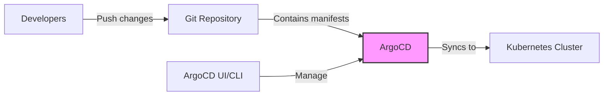
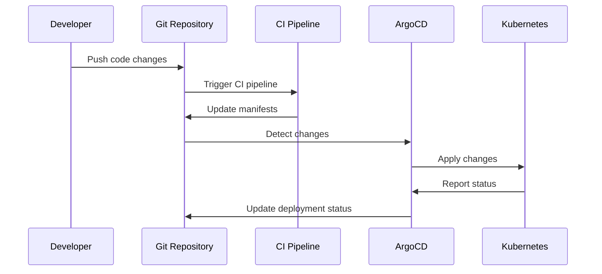

# ArgoCD Setup Guide for Kubernetes

## Overview

!!! info "Guide Information"
    **Difficulty**: Intermediate  
    **Time Required**: ~45 minutes  
    **Last Updated**: March 2024  
    **ArgoCD Version**: v2.9.3  
    **Kubernetes Compatibility**: K3s, K8s 1.24+  
    **OS**: Debian 12

This guide provides comprehensive instructions for setting up ArgoCD in a Kubernetes or K3s cluster, configuring Traefik ingress, and securing it with cert-manager for automatic SSL certificate renewal.

## What is ArgoCD?

ArgoCD is a declarative, GitOps continuous delivery tool for Kubernetes. It automates the deployment of applications to Kubernetes clusters by monitoring Git repositories and applying changes when they occur.



## Prerequisites

!!! abstract "Requirements"
    - A running Kubernetes or K3s cluster
    - `kubectl` installed and configured
    - `helm` v3.x installed
    - A domain name for ArgoCD access
    - DNS record pointing to your cluster's IP
    - Administrative access to your cluster

## Installation Steps

### 1. Prepare Your Cluster

=== "For Standard Kubernetes"
    ```bash
    # Verify cluster access
    kubectl cluster-info
    
    # Create namespace for ArgoCD
    kubectl create namespace argocd
    ```

=== "For K3s"
    ```bash
    # Verify K3s is running
    sudo systemctl status k3s
    
    # Create namespace for ArgoCD
    kubectl create namespace argocd
    ```

### 2. Install ArgoCD

There are two methods to install ArgoCD: using manifests directly or using Helm.

=== "Using Manifests"
    ```bash
    # Apply the ArgoCD installation manifest
    kubectl apply -n argocd -f https://raw.githubusercontent.com/argoproj/argo-cd/v2.9.3/manifests/install.yaml
    
    # Verify pods are running
    kubectl get pods -n argocd
    ```

=== "Using Helm"
    ```bash
    # Add ArgoCD Helm repository
    helm repo add argo https://argoproj.github.io/argo-helm
    helm repo update
    
    # Install ArgoCD
    helm install argocd argo/argo-cd \
      --namespace argocd \
      --create-namespace \
      --version 5.51.4 \
      --set server.extraArgs="{--insecure}" \
      --set controller.metrics.enabled=true \
      --set server.metrics.enabled=true
    ```

!!! tip "Resource Requirements"
    ArgoCD is relatively lightweight, but for production use, consider allocating:
    - At least 2 CPU cores and 4GB RAM for the cluster
    - 1GB RAM for the ArgoCD controller
    - 512MB RAM for the ArgoCD server

### 3. Install cert-manager

cert-manager is required to automatically provision and manage TLS certificates.

```bash
# Add Jetstack Helm repository
helm repo add jetstack https://charts.jetstack.io
helm repo update

# Install cert-manager with CRDs
helm install cert-manager jetstack/cert-manager \
  --namespace cert-manager \
  --create-namespace \
  --version v1.13.2 \
  --set installCRDs=true

# Verify cert-manager pods are running
kubectl get pods -n cert-manager
```

### 4. Configure ClusterIssuer for Let's Encrypt

Create a ClusterIssuer to obtain certificates from Let's Encrypt:

```yaml title="letsencrypt-issuer.yaml" linenums="1"
apiVersion: cert-manager.io/v1
kind: ClusterIssuer
metadata:
  name: letsencrypt-prod
spec:
  acme:
    server: https://acme-v02.api.letsencrypt.org/directory
    email: your-email@example.com  # Replace with your email
    privateKeySecretRef:
      name: letsencrypt-prod
    solvers:
    - http01:
        ingress:
          class: traefik
```

Apply the ClusterIssuer:

```bash
# Apply the ClusterIssuer
kubectl apply -f letsencrypt-issuer.yaml

# Verify the ClusterIssuer is ready
kubectl get clusterissuer letsencrypt-prod -o wide
```

!!! warning "Rate Limits"
    Let's Encrypt has rate limits: 50 certificates per domain per week. Use the staging server (`https://acme-staging-v02.api.letsencrypt.org/directory`) for testing.

### 5. Configure Traefik Ingress for ArgoCD

Create an Ingress resource for ArgoCD:

```yaml title="argocd-ingress.yaml" linenums="1"
apiVersion: networking.k8s.io/v1
kind: Ingress
metadata:
  name: argocd-server-ingress
  namespace: argocd
  annotations:
    cert-manager.io/cluster-issuer: "letsencrypt-prod"
    traefik.ingress.kubernetes.io/router.entrypoints: "websecure"
    traefik.ingress.kubernetes.io/router.tls: "true"
    traefik.ingress.kubernetes.io/router.middlewares: "argocd-argocd-middleware@kubernetescrd"
spec:
  ingressClassName: traefik
  tls:
  - hosts:
    - argocd.example.com  # Replace with your domain
    secretName: argocd-server-tls
  rules:
  - host: argocd.example.com  # Replace with your domain
    http:
      paths:
      - path: /
        pathType: Prefix
        backend:
          service:
            name: argocd-server
            port:
              number: 80
```

Create a middleware to handle gRPC and HTTP traffic:

```yaml title="argocd-middleware.yaml" linenums="1"
apiVersion: traefik.containo.us/v1alpha1
kind: Middleware
metadata:
  name: argocd-middleware
  namespace: argocd
spec:
  headers:
    customRequestHeaders:
      X-Forwarded-Proto: "https"
```

Apply the configurations:

```bash
# Apply the middleware
kubectl apply -f argocd-middleware.yaml

# Apply the ingress
kubectl apply -f argocd-ingress.yaml

# Check the status of the ingress
kubectl get ingress -n argocd
```

## Accessing ArgoCD

### Initial Login

Once ArgoCD is installed and the ingress is configured, you can access it via your domain (e.g., `https://argocd.example.com`).

=== "Get Initial Password"
    ```bash
    # For manifest installation
    kubectl -n argocd get secret argocd-initial-admin-secret -o jsonpath="{.data.password}" | base64 -d
    
    # For Helm installation (if using default values)
    kubectl -n argocd get secret argocd-initial-admin-secret -o jsonpath="{.data.password}" | base64 -d
    ```

=== "Login via CLI"
    ```bash
    # Install ArgoCD CLI
    curl -sSL -o argocd-linux-amd64 https://github.com/argoproj/argo-cd/releases/download/v2.9.3/argocd-linux-amd64
    sudo install -m 555 argocd-linux-amd64 /usr/local/bin/argocd
    rm argocd-linux-amd64
    
    # Login using CLI
    argocd login argocd.example.com
    
    # Change the default password
    argocd account update-password
    ```

!!! danger "Security Note"
    Always change the default admin password immediately after the first login!

### Setting Up Your First Application

After logging in, you can deploy your first application:

1. Click on "+ New App" in the UI
2. Fill in the application details:
   - Name: `example-app`
   - Project: `default`
   - Sync Policy: `Automatic`
   - Repository URL: Your Git repository URL
   - Path: Path to your Kubernetes manifests
   - Cluster: `https://kubernetes.default.svc` (for in-cluster deployment)
   - Namespace: Your target namespace

## Security Hardening

!!! security "Security Best Practices"
    1. **RBAC Configuration**: Limit access to ArgoCD
    2. **SSO Integration**: Connect to your identity provider
    3. **Network Policies**: Restrict pod communication
    4. **Secrets Management**: Use external secret stores

### Configure RBAC

Create a custom RBAC policy:

```yaml title="argocd-rbac-cm.yaml" linenums="1"
apiVersion: v1
kind: ConfigMap
metadata:
  name: argocd-rbac-cm
  namespace: argocd
data:
  policy.csv: |
    p, role:readonly, applications, get, */*, allow
    p, role:readonly, clusters, get, *, allow
    p, role:developer, applications, create, */*, allow
    p, role:developer, applications, update, */*, allow
    p, role:developer, applications, delete, */*, allow
    g, developer@example.com, role:developer
    g, viewer@example.com, role:readonly
  policy.default: role:readonly
```

Apply the ConfigMap:

```bash
kubectl apply -f argocd-rbac-cm.yaml
```

### Configure SSO (GitHub Example)

Update the ArgoCD ConfigMap:

```yaml title="argocd-cm.yaml" linenums="1"
apiVersion: v1
kind: ConfigMap
metadata:
  name: argocd-cm
  namespace: argocd
data:
  url: https://argocd.example.com
  dex.config: |
    connectors:
      - type: github
        id: github
        name: GitHub
        config:
          clientID: your-github-client-id
          clientSecret: $dex.github.clientSecret
          orgs:
          - name: your-github-org
```

Create a secret for GitHub OAuth:

```bash
kubectl -n argocd create secret generic github-secret \
  --from-literal=clientSecret=your-github-client-secret
```

Apply the ConfigMap:

```bash
kubectl apply -f argocd-cm.yaml
```

## Network Policies

Restrict network traffic to ArgoCD:

```yaml title="argocd-network-policy.yaml" linenums="1"
apiVersion: networking.k8s.io/v1
kind: NetworkPolicy
metadata:
  name: argocd-server-network-policy
  namespace: argocd
spec:
  podSelector:
    matchLabels:
      app.kubernetes.io/name: argocd-server
  policyTypes:
  - Ingress
  ingress:
  - from:
    - namespaceSelector: {}
    ports:
    - protocol: TCP
      port: 80
    - protocol: TCP
      port: 443
```

Apply the network policy:

```bash
kubectl apply -f argocd-network-policy.yaml
```

## Troubleshooting

### Common Issues and Solutions

!!! bug "Common Problems"

    === "Ingress Not Working"
        **Symptoms**: Unable to access ArgoCD through the domain
        
        **Solutions**:
        1. Check if the certificate is issued correctly:
           ```bash
           kubectl get certificate -n argocd
           ```
        2. Verify Traefik is properly configured:
           ```bash
           kubectl get ingressroute -A
           ```
        3. Check the Traefik logs:
           ```bash
           kubectl logs -n kube-system -l app.kubernetes.io/name=traefik
           ```

    === "Certificate Issues"
        **Symptoms**: SSL errors or certificate not issuing
        
        **Solutions**:
        1. Check cert-manager logs:
           ```bash
           kubectl logs -n cert-manager -l app=cert-manager
           ```
        2. Verify the ClusterIssuer status:
           ```bash
           kubectl describe clusterissuer letsencrypt-prod
           ```
        3. Check certificate request status:
           ```bash
           kubectl get certificaterequest -n argocd
           ```

    === "ArgoCD Server Crashes"
        **Symptoms**: ArgoCD UI unavailable, server pods restarting
        
        **Solutions**:
        1. Check server logs:
           ```bash
           kubectl logs -n argocd -l app.kubernetes.io/name=argocd-server
           ```
        2. Verify resource allocation:
           ```bash
           kubectl top pods -n argocd
           ```
        3. Check for eviction events:
           ```bash
           kubectl get events -n argocd
           ```

### Diagnostic Commands

Here are some useful commands for diagnosing issues:

```bash title="Diagnostic Commands"
# Check all ArgoCD components
kubectl get pods -n argocd

# Check ArgoCD server logs
kubectl logs -n argocd -l app.kubernetes.io/name=argocd-server

# Check ArgoCD application controller logs
kubectl logs -n argocd -l app.kubernetes.io/name=argocd-application-controller

# Check certificate status
kubectl get certificate -n argocd

# Check ingress status
kubectl describe ingress argocd-server-ingress -n argocd
```

## Maintenance

### Upgrading ArgoCD

=== "Using Manifests"
    ```bash
    # Update to a new version
    kubectl apply -n argocd -f https://raw.githubusercontent.com/argoproj/argo-cd/v2.9.3/manifests/install.yaml
    ```

=== "Using Helm"
    ```bash
    # Update Helm repositories
    helm repo update
    
    # Upgrade ArgoCD
    helm upgrade argocd argo/argo-cd \
      --namespace argocd \
      --version 5.51.4
    ```

!!! tip "Backup Before Upgrading"
    Always backup your ArgoCD settings before upgrading:
    ```bash
    kubectl get -n argocd -o yaml configmap,secret,application > argocd-backup.yaml
    ```

### Monitoring ArgoCD

ArgoCD exposes Prometheus metrics that can be scraped for monitoring:

```yaml title="argocd-prometheus-servicemonitor.yaml" linenums="1"
apiVersion: monitoring.coreos.com/v1
kind: ServiceMonitor
metadata:
  name: argocd-metrics
  namespace: monitoring
spec:
  selector:
    matchLabels:
      app.kubernetes.io/name: argocd-metrics
  endpoints:
  - port: metrics
```

## Advanced Configuration

### GitOps Workflow Example



### Multi-Cluster Setup

For managing multiple clusters with ArgoCD:

1. Register the external cluster:
   ```bash
   argocd cluster add context-name
   ```

2. Create applications targeting the external cluster:
   ```yaml
   apiVersion: argoproj.io/v1alpha1
   kind: Application
   metadata:
     name: multi-cluster-app
     namespace: argocd
   spec:
     destination:
       namespace: default
       server: https://external-cluster-api-url
     project: default
     source:
       path: path/to/manifests
       repoURL: https://github.com/your-org/your-repo.git
       targetRevision: HEAD
     syncPolicy:
       automated:
         prune: true
         selfHeal: true
   ```

## Conclusion

You now have a fully functional ArgoCD setup with:

- Secure access via HTTPS
- Automatic certificate management
- Traefik ingress integration
- Basic security hardening

!!! success "Next Steps"
    - Configure notifications
    - Set up project templates
    - Integrate with your CI pipeline
    - Explore ApplicationSets for multi-cluster management

## References

- [ArgoCD Documentation](https://argo-cd.readthedocs.io/en/stable/)
- [cert-manager Documentation](https://cert-manager.io/docs/)
- [Traefik Documentation](https://doc.traefik.io/traefik/)
- [Kubernetes Documentation](https://kubernetes.io/docs/home/)
