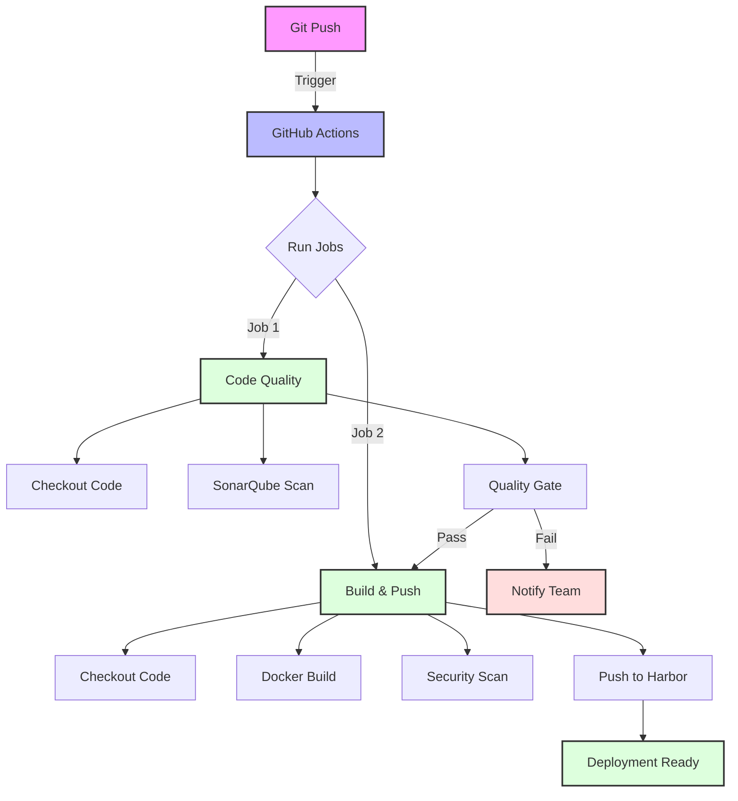
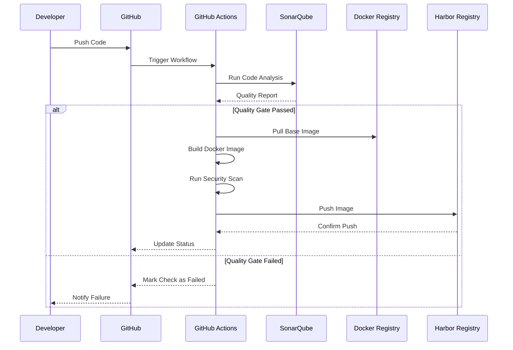
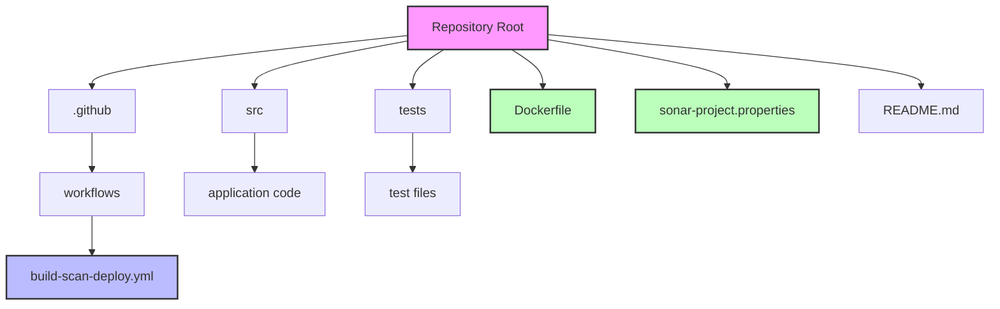
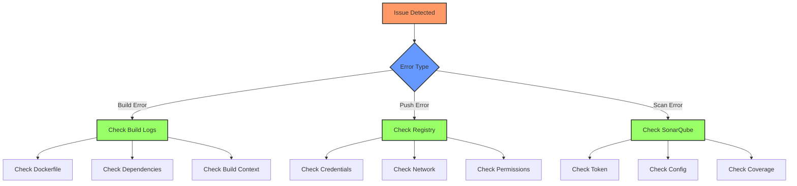
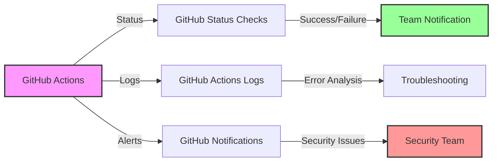

# GitHub Actions: SonarQube Scanning & Docker Image Deployment to Harbor

## Overview

!!! info "Guide Information"
    **Difficulty**: Intermediate  
    **Time Required**: ~30 minutes for setup  
    **Last Updated**: March 2025  
    **GitHub Actions Version**: v4.2 (2025)  
    **SonarQube Version**: 11.2 LTS  
    **Harbor Version**: 3.2  
    **Docker Version**: 26.0

This guide provides comprehensive instructions for setting up a GitHub Actions workflow that:

1. Scans your code using SonarQube for quality and security issues
2. Builds a Docker image from your codebase
3. Pushes the image to a private Harbor registry

## Workflow Architecture



## CI/CD Process Flow



## Prerequisites

Before you begin, ensure you have:

- A GitHub account with a private repository containing your application code
- Admin access to a SonarQube instance (self-hosted or SonarCloud)
- Access to a Harbor registry instance
- A Dockerfile in your repository that defines your application image
- Basic understanding of YAML and GitHub Actions concepts

## Repository Structure



## Step-by-Step Implementation

### 1. Create GitHub Secrets

First, you'll need to add the following secrets to your GitHub repository:

1. Navigate to your GitHub repository
2. Go to **Settings** > **Secrets and variables** > **Actions**
3. Click **New repository secret** and add the following:

| Secret Name | Description |
|-------------|-------------|
| `SONAR_TOKEN` | Authentication token for SonarQube |
| `SONAR_HOST_URL` | URL of your SonarQube instance |
| `HARBOR_USERNAME` | Username for Harbor registry |
| `HARBOR_PASSWORD` | Password or access token for Harbor registry |
| `HARBOR_URL` | URL of your Harbor registry |
| `HARBOR_PROJECT` | Project name in Harbor |

### 2. Create the GitHub Actions Workflow File

Create a new file at `.github/workflows/build-scan-deploy.yml`:

```yaml
name: Build, Scan and Deploy

on:
  push:
    branches: [ main, develop ]
  pull_request:
    branches: [ main, develop ]
  workflow_dispatch:

env:
  IMAGE_NAME: my-application
  IMAGE_TAG: ${{ github.sha }}

jobs:
  code-quality:
    name: Code Quality Scan
    runs-on: ubuntu-latest
    permissions:
      security-events: write
      actions: read
      contents: read
    
    steps:
      - name: Checkout code
        uses: actions/checkout@v5
        with:
          fetch-depth: 0

      - name: SonarQube Scan
        uses: SonarSource/sonarqube-scan-action@v4
        env:
          SONAR_TOKEN: ${{ secrets.SONAR_TOKEN }}
          SONAR_HOST_URL: ${{ secrets.SONAR_HOST_URL }}
        with:
          args: >
            -Dsonar.projectKey=${{ github.repository_owner }}_${{ github.event.repository.name }}
            -Dsonar.projectName=${{ github.repository_owner }}_${{ github.event.repository.name }}
            -Dsonar.python.version=3.12
            -Dsonar.qualitygate.wait=true

      - name: SonarQube Quality Gate
        uses: SonarSource/sonarqube-quality-gate-action@v3
        timeout-minutes: 5
        env:
          SONAR_TOKEN: ${{ secrets.SONAR_TOKEN }}
          SONAR_HOST_URL: ${{ secrets.SONAR_HOST_URL }}

  build-and-push:
    name: Build and Push Docker Image
    needs: code-quality
    runs-on: ubuntu-latest
    permissions:
      packages: write
      contents: read
    
    steps:
      - name: Checkout code
        uses: actions/checkout@v5

      - name: Set up Docker Buildx
        uses: docker/setup-buildx-action@v3
        with:
          version: v0.12.0
          buildkitd-flags: --debug

      - name: Login to Harbor
        uses: docker/login-action@v3
        with:
          registry: ${{ secrets.HARBOR_URL }}
          username: ${{ secrets.HARBOR_USERNAME }}
          password: ${{ secrets.HARBOR_PASSWORD }}

      - name: Generate Image Tags
        id: meta
        uses: docker/metadata-action@v5
        with:
          images: ${{ secrets.HARBOR_URL }}/${{ secrets.HARBOR_PROJECT }}/${{ env.IMAGE_NAME }}
          tags: |
            type=raw,value=latest,enable=${{ github.ref == 'refs/heads/main' }}
            type=sha,format=short
            type=ref,event=branch
            type=semver,pattern={{version}}
            type=semver,pattern={{major}}.{{minor}}

      - name: Build and Push Docker Image
        uses: docker/build-push-action@v5
        with:
          context: .
          push: true
          tags: ${{ steps.meta.outputs.tags }}
          labels: ${{ steps.meta.outputs.labels }}
          cache-from: type=registry,ref=${{ secrets.HARBOR_URL }}/${{ secrets.HARBOR_PROJECT }}/${{ env.IMAGE_NAME }}:buildcache
          cache-to: type=registry,ref=${{ secrets.HARBOR_URL }}/${{ secrets.HARBOR_PROJECT }}/${{ env.IMAGE_NAME }}:buildcache,mode=max
          platforms: linux/amd64,linux/arm64
          build-args: |
            BUILD_DATE=$(date -u +'%Y-%m-%dT%H:%M:%SZ')
            VCS_REF=${{ github.sha }}
            VERSION=${{ steps.meta.outputs.version }}

      - name: Run Trivy vulnerability scanner
        uses: aquasecurity/trivy-action@master
        with:
          image-ref: ${{ secrets.HARBOR_URL }}/${{ secrets.HARBOR_PROJECT }}/${{ env.IMAGE_NAME }}:${{ github.sha }}
          format: 'sarif'
          output: 'trivy-results.sarif'
          severity: 'CRITICAL,HIGH'
          timeout: '10m0s'

      - name: Upload Trivy scan results to GitHub Security tab
        uses: github/codeql-action/upload-sarif@v3
        if: always()
        with:
          sarif_file: 'trivy-results.sarif'
```

### 3. Configure SonarQube Properties

Create a `sonar-project.properties` file:

```properties
sonar.projectKey=${PROJECT_KEY}
sonar.projectName=${PROJECT_NAME}
sonar.projectVersion=1.0

sonar.sources=src
sonar.tests=tests
sonar.sourceEncoding=UTF-8

sonar.exclusions=**/node_modules/**,**/*.spec.ts,**/dist/**,**/coverage/**
sonar.javascript.lcov.reportPaths=coverage/lcov.info

sonar.python.version=3.12
sonar.python.coverage.reportPaths=coverage.xml
sonar.python.flake8.reportPaths=flake8-report.txt

sonar.security.config.path=.sonarqube/security-config.json
```

### 4. Modern Dockerfile Example

```dockerfile
# Syntax version for better caching and security
# syntax=docker/dockerfile:1.6

# Build stage
FROM node:20-alpine AS builder

# Use non-root user for security
USER node
WORKDIR /app

# Copy package files
COPY --chown=node:node package*.json ./

# Install dependencies with exact versions
RUN npm ci --only=production

# Copy source code
COPY --chown=node:node . .

# Build application
RUN npm run build

# Production stage
FROM node:20-alpine AS production

# Set security headers
LABEL org.opencontainers.image.security.policy="policy.json"

# Use non-root user
USER node
WORKDIR /app

# Copy only production files
COPY --from=builder --chown=node:node /app/package*.json ./
COPY --from=builder --chown=node:node /app/node_modules ./node_modules
COPY --from=builder --chown=node:node /app/dist ./dist

# Set environment
ENV NODE_ENV=production \
    PORT=3000

# Expose port
EXPOSE 3000

# Health check
HEALTHCHECK --interval=30s --timeout=3s \
  CMD wget --no-verbose --tries=1 --spider http://localhost:3000/health || exit 1

# Start application
CMD ["node", "dist/main.js"]
```

## Security Best Practices

## Troubleshooting Guide



## Common Issues and Solutions

### SonarQube Analysis Fails

**Issue**: SonarQube scan fails with authentication errors.
**Solution**:
- Verify SONAR_TOKEN is valid and not expired
- Check SonarQube instance accessibility
- Ensure correct project permissions

### Docker Build Fails

**Issue**: Docker build fails with errors.
**Solution**:
- Check Dockerfile syntax
- Verify build context
- Check base image availability
- Validate multi-stage build steps

### Harbor Push Fails

**Issue**: Cannot push to Harbor registry.
**Solution**:
- Verify Harbor credentials
- Check project exists and permissions
- Validate network connectivity
- Ensure image tag format is correct

## Monitoring and Alerts



## Conclusion

This GitHub Actions workflow provides a modern, secure CI/CD pipeline that ensures code quality through SonarQube scanning and delivers secure, versioned Docker images to your Harbor registry. The workflow includes best practices for 2025, including:

- Multi-platform builds (amd64/arm64)
- Advanced security scanning
- Comprehensive error handling
- Modern Docker features
- Detailed monitoring and alerting

For more advanced scenarios or customizations, refer to:
- [GitHub Actions Documentation](https://docs.github.com/en/actions)
- [SonarQube Documentation](https://docs.sonarqube.org/)
- [Harbor Documentation](https://goharbor.io/docs/)

!!! tip "Next Steps"
    Consider integrating this workflow with ArgoCD for continuous deployment to your Kubernetes cluster. See our [ArgoCD Setup Guide](../../argocd-setup.md) for more information.
