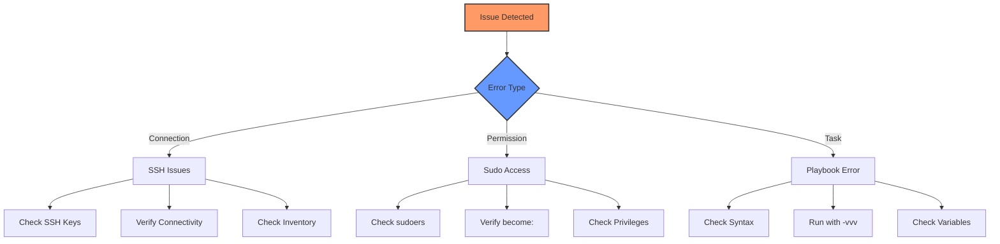

# Ansible: Automation at Scale

!!! info "Guide Information"
    **Difficulty**: Intermediate  
    **Time Required**: ~45 minutes for setup  
    **Last Updated**: March 2025  
    **Ansible Version**: 9.2.0  
    **Ansible Galaxy Version**: 4.5.0  
    **Python Version**: 3.12

This comprehensive guide covers Ansible installation, configuration, and practical use cases for DevOps automation. You'll learn how to use Ansible for server preparation, package management, and integrating with GitHub Actions for automated deployments.

## Prerequisites

Before starting, ensure you have:
- Python 3.12 or newer installed
- Access to target servers (SSH access)
- Sudo privileges on both control and target machines
- Basic understanding of YAML syntax
- GitHub account (for GitHub Actions integration)

## Installation

### Installing Ansible

```bash
# Update package list
sudo apt update

# Install Python 3 and pip
sudo apt install -y python3 python3-pip

# Install Ansible using pip
python3 -m pip install --user ansible==9.2.0

# Verify installation
ansible --version
```

### Installing Ansible Galaxy

```bash
# Install Ansible Galaxy
python3 -m pip install --user ansible-galaxy

# Verify installation
ansible-galaxy --version
```

## Basic Configuration

### 1. Configure Inventory

Create an inventory file at `/etc/ansible/hosts` or in your project directory:

```ini
[webservers]
web1 ansible_host=192.168.1.101
web2 ansible_host=192.168.1.102

[dbservers]
db1 ansible_host=192.168.1.201

[kubernetes_nodes]
master ansible_host=192.168.1.10
worker1 ansible_host=192.168.1.11
worker2 ansible_host=192.168.1.12

[all:vars]
ansible_python_interpreter=/usr/bin/python3
ansible_user=your_ssh_user
```

### 2. Configure SSH Keys

```bash
# Generate SSH key
ssh-keygen -t ed25519 -C "ansible"

# Copy key to remote servers
ssh-copy-id -i ~/.ssh/ansible your_user@remote_host
```

## Common Tasks and Playbooks

### Server Preparation Playbook

```yaml
# server_prep.yml
---
- name: Prepare servers for Kubernetes
  hosts: kubernetes_nodes
  become: yes
  
  tasks:
    - name: Update apt cache
      apt:
        update_cache: yes
        cache_valid_time: 3600

    - name: Install common packages
      apt:
        name:
          - neovim
          - vim
          - docker.io
          - docker-compose
          - ncdu
          - gdu
          - logrotate
          - nginx
          - certbot
          - python3-certbot-nginx
        state: present

    - name: Configure UFW
      ufw:
        rule: allow
        port: "{{ item }}"
        proto: tcp
      loop:
        - 22
        - 80
        - 443
        - 6443  # Kubernetes API
        - 2379  # etcd
        - 2380  # etcd peer
        - 10250 # Kubelet API

    - name: Enable UFW
      ufw:
        state: enabled
        policy: deny

    - name: Configure logrotate
      template:
        src: templates/logrotate.j2
        dest: /etc/logrotate.d/custom
        mode: '0644'
```

### Docker Deployment Playbook

```yaml
# docker_deploy.yml
---
- name: Deploy Docker Applications
  hosts: webservers
  become: yes
  
  vars:
    harbor_registry: harbor.example.com
    harbor_project: myproject
    harbor_username: "{{ lookup('env', 'HARBOR_USERNAME') }}"
    harbor_password: "{{ lookup('env', 'HARBOR_PASSWORD') }}"
  
  tasks:
    - name: Log into Harbor registry
      docker_login:
        registry_url: "{{ harbor_registry }}"
        username: "{{ harbor_username }}"
        password: "{{ harbor_password }}"
        reauthorize: yes

    - name: Create Docker Compose directory
      file:
        path: /opt/docker-compose
        state: directory
        mode: '0755'

    - name: Copy Docker Compose file
      template:
        src: templates/docker-compose.yml.j2
        dest: /opt/docker-compose/docker-compose.yml
        mode: '0644'

    - name: Deploy using Docker Compose
      docker_compose:
        project_src: /opt/docker-compose
        pull: yes
        recreate: always
```

## GitHub Actions Integration

### Workflow Example

```yaml
# .github/workflows/ansible-deploy.yml
name: Build and Deploy with Ansible

on:
  push:
    branches: [ main ]
  workflow_dispatch:

jobs:
  build-and-deploy:
    runs-on: ubuntu-latest
    
    steps:
      - uses: actions/checkout@v5

      - name: Set up Docker Buildx
        uses: docker/setup-buildx-action@v3

      - name: Login to Harbor
        uses: docker/login-action@v3
        with:
          registry: ${{ secrets.HARBOR_URL }}
          username: ${{ secrets.HARBOR_USERNAME }}
          password: ${{ secrets.HARBOR_PASSWORD }}

      - name: Build and push
        uses: docker/build-push-action@v5
        with:
          push: true
          tags: ${{ secrets.HARBOR_URL }}/${{ secrets.HARBOR_PROJECT }}/myapp:${{ github.sha }}

      - name: Install Ansible
        run: |
          python -m pip install --user ansible==9.2.0
          python -m pip install --user ansible-galaxy

      - name: Set up SSH key
        run: |
          mkdir -p ~/.ssh
          echo "${{ secrets.SSH_PRIVATE_KEY }}" > ~/.ssh/id_ed25519
          chmod 600 ~/.ssh/id_ed25519
          ssh-keyscan -H ${{ secrets.SERVER_HOST }} >> ~/.ssh/known_hosts

      - name: Run Ansible playbook
        env:
          HARBOR_USERNAME: ${{ secrets.HARBOR_USERNAME }}
          HARBOR_PASSWORD: ${{ secrets.HARBOR_PASSWORD }}
        run: |
          ansible-playbook -i inventory.yml docker_deploy.yml
```

## Environment Variables Management

### Using Ansible Vault

```bash
# Create encrypted variables file
ansible-vault create vars/secrets.yml

# Edit encrypted file
ansible-vault edit vars/secrets.yml

# Run playbook with vault
ansible-playbook playbook.yml --ask-vault-pass
```

Example encrypted variables:

```yaml
# vars/secrets.yml (encrypted)
harbor_credentials:
  username: myuser
  password: mypassword
db_credentials:
  user: dbuser
  password: dbpassword
```

## Troubleshooting

### Common Issues and Solutions



### Debugging Tips

1. **Verbose Output**
   ```bash
   ansible-playbook playbook.yml -vvv
   ```

2. **Check Syntax**
   ```bash
   ansible-playbook playbook.yml --syntax-check
   ```

3. **Dry Run**
   ```bash
   ansible-playbook playbook.yml --check
   ```

## Best Practices

1. **Role Organization**
   - Use roles for reusable configurations
   - Keep roles focused and modular
   - Use Galaxy for common tasks

2. **Variable Management**
   - Use group_vars and host_vars
   - Encrypt sensitive data with Vault
   - Use meaningful variable names

3. **Playbook Structure**
   - Keep playbooks simple and focused
   - Use tags for selective execution
   - Document roles and variables

4. **Security**
   - Use SSH keys instead of passwords
   - Regularly rotate credentials
   - Limit sudo access to required commands

## Conclusion

This guide covered the essential aspects of using Ansible for automation, from basic setup to advanced integration with GitHub Actions and Harbor. For more information, refer to:

- [Ansible Documentation](https://docs.ansible.com/)
- [Ansible Galaxy](https://galaxy.ansible.com/)
- [GitHub Actions Documentation](https://docs.github.com/en/actions)

!!! tip "Next Steps"
    Consider exploring more advanced topics like:
    - Dynamic inventory management
    - Custom module development
    - Advanced role development
    - Integration with other CI/CD tools
