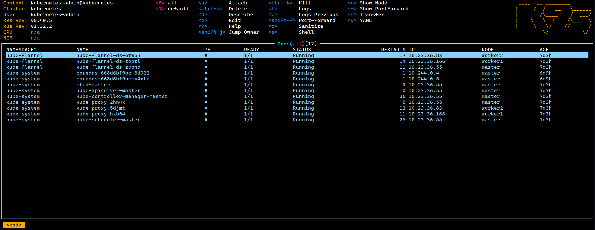

# K9s: Terminal UI for Kubernetes

K9s is a powerful terminal-based UI for interacting with Kubernetes clusters. It provides an intuitive interface to navigate, observe, and manage your applications and resources.



## Why Use K9s?

K9s offers several advantages over traditional kubectl commands:

1. **Real-time Monitoring**: Live updates of cluster resources
2. **Intuitive Navigation**: Easy keyboard shortcuts and commands
3. **Resource Management**: Quick access to logs, shell, and resource editing
4. **Cluster Context Switching**: Seamless switching between multiple clusters
5. **Resource Filtering**: Powerful search and filtering capabilities
6. **Plugin System**: Extensible with custom plugins
7. **Resource Metrics**: CPU/Memory usage visualization

## Installation

### Using Package Managers

=== "Debian/Ubuntu"
    ```bash
    # Using apt (Recommended)
    curl -fsSL https://pkgs.k9s.dev/key.gpg | sudo gpg --dearmor -o /usr/share/keyrings/k9s-archive-keyring.gpg
    echo "deb [signed-by=/usr/share/keyrings/k9s-archive-keyring.gpg] https://pkgs.k9s.dev/deb stable main" | sudo tee /etc/apt/sources.list.d/k9s.list
    sudo apt update
    sudo apt install k9s

    # Using snap
    sudo snap install k9s
    ```

=== "RedHat/Fedora"
    ```bash
    # Using dnf
    sudo dnf config-manager --add-repo https://pkgs.k9s.dev/rpm/k9s.repo
    sudo dnf install k9s

    # Alternative: Direct RPM installation
    VERSION=$(curl -s https://api.github.com/repos/derailed/k9s/releases/latest | grep tag_name | cut -d '"' -f 4)
    curl -LO https://github.com/derailed/k9s/releases/download/${VERSION}/k9s_Linux_amd64.rpm
    sudo rpm -ivh k9s_Linux_amd64.rpm
    ```

=== "Arch Linux"
    ```bash
    # Using pacman
    sudo pacman -S k9s

    # Using yay (AUR)
    yay -S k9s-bin
    ```

### Using Binary Release

```bash
# Download latest binary
VERSION=$(curl -s https://api.github.com/repos/derailed/k9s/releases/latest | grep tag_name | cut -d '"' -f 4)
curl -LO https://github.com/derailed/k9s/releases/download/${VERSION}/k9s_Linux_amd64.tar.gz

# Extract and install
tar xzf k9s_Linux_amd64.tar.gz
sudo install -o root -g root -m 0755 k9s /usr/local/bin/k9s

# Verify installation
k9s version
```

### Using Container Image

```bash
# Run using Docker
docker run --rm -it -v ~/.kube/config:/root/.kube/config ghcr.io/derailed/k9s

# Run using Podman
podman run --rm -it -v ~/.kube/config:/root/.kube/config ghcr.io/derailed/k9s
```

!!! tip "Installation Best Practices"
    - Always verify GPG keys and signatures when installing via package managers
    - Keep K9s updated to benefit from the latest features and security fixes
    - Consider using the container image in restricted environments
    - Back up your K9s configuration before upgrading

## Basic Usage

### Starting K9s
```bash
# Start with default context
k9s

# Start with specific context
k9s --context my-cluster

# Start in a specific namespace
k9s -n kube-system
```

## Key Features and Commands

### Navigation
- `0-9`: Switch to namespace
- `:`: Enter command mode
- `/`: Enter filter mode
- `esc`: Go back/Clear filter
- `ctrl-a`: Show all resources
- `ctrl-d`: Delete resource
- `ctrl-k`: Kill pod
- `?`: Show help

### Resource Views
```bash
# Access different resources using commands
:pods          # View pods
:deployments   # View deployments
:services      # View services
:nodes         # View nodes
:configmaps    # View configmaps
:secrets       # View secrets
```

### Pod Management
```bash
# While in pod view
l              # View logs
s              # Shell into container
d              # Describe pod
e              # Edit pod
y              # YAML view
ctrl-k         # Kill pod
```

### Cluster Context Management
```bash
# Switch contexts
:context       # List available contexts
ctrl-c         # Open context switch menu
```

## Multi-Cluster Configuration

### Using Different Kubeconfig Files

1. **Default Configuration**:
```bash
# K9s uses default kubeconfig at ~/.kube/config
k9s
```

2. **Specific Kubeconfig**:
```bash
# Use a specific kubeconfig file
k9s --kubeconfig=/path/to/kubeconfig

# Set environment variable
export KUBECONFIG=/path/to/kubeconfig
k9s
```

3. **Multiple Kubeconfig Files**:
```bash
# Merge multiple kubeconfig files
export KUBECONFIG=~/.kube/config-cluster1:~/.kube/config-cluster2
k9s
```

### Creating Cluster-Specific Aliases
```bash
# Add to your ~/.bashrc or ~/.zshrc
alias k9s-prod="k9s --kubeconfig=/path/to/prod-kubeconfig"
alias k9s-dev="k9s --kubeconfig=/path/to/dev-kubeconfig"
alias k9s-staging="k9s --kubeconfig=/path/to/staging-kubeconfig"
```

## Customization

### Configuration File
K9s uses a configuration file located at `~/.k9s/config.yml`:

```yaml
k9s:
  refreshRate: 2
  maxConnRetry: 5
  enableMouse: false
  headless: false
  logoless: false
  crumbsless: false
  readOnly: false
  noIcons: false
  logger:
    tail: 100
    buffer: 5000
    sinceSeconds: 60
    fullScreenLogs: false
    textWrap: false
    showTime: false
  currentContext: minikube
  currentCluster: minikube
  clusters:
    minikube:
      namespace:
        active: default
        favorites:
        - default
        - kube-system
      view:
        active: pods
      featureGates:
        nodeShell: false
      shellPod:
        image: busybox:1.31
        command: []
        args: []
        namespace: default
```

### Skin Customization
Create a custom skin at `~/.k9s/skin.yml`:

```yaml
k9s:
  body:
    fgColor: dodgerblue
    bgColor: black
    logoColor: orange
  prompt:
    fgColor: cadetblue
    bgColor: black
    suggestColor: dodgerblue
  info:
    fgColor: orange
    sectionColor: white
```

## Best Practices

### 1. Resource Organization

* Use namespaces as logical groupings for resources
* Create custom resource views for different workflows
* Utilize labels and filters for efficient resource management
* Set up port-forwarding for frequently accessed services

### 2. Performance Optimization

* Increase refresh rate in large clusters (>1000 pods)
* Filter by namespace when working in specific areas
* Use readonly mode for monitoring to reduce API calls
* Limit resource views to relevant namespaces

### 3. Security Considerations

* Maintain separate kubeconfig files for each environment
* Enable readonly mode for audit and review tasks
* Follow the principle of least privilege with RBAC
* Regularly rotate cluster credentials
* Use context-specific configurations

### 4. Workflow Efficiency

* Master essential keyboard shortcuts (`:`, `/`, `ctrl+a`)
* Configure custom skins for better visibility
* Set up command aliases for common operations
* Use hotkeys for frequent namespace switches
* Configure persistent views for regular tasks

### 5. Cluster Management

* Monitor resource utilization with built-in metrics
* Set up custom resource views for different roles
* Use benchmarks for performance monitoring
* Configure alerts for critical resources

### 6. Troubleshooting

* Enable logging for debugging sessions
* Use describe and events for detailed resource info
* Set up custom views for error tracking
* Configure proper log buffer sizes

## Troubleshooting

### Common Issues

1. **Connection Problems**:
```bash
# Check kubeconfig
k9s info

# Verify cluster access
kubectl cluster-info
```

2. **Performance Issues**:
```yaml
# Adjust refresh rate in ~/.k9s/config.yml
k9s:
  refreshRate: 5  # Increase refresh interval
```

3. **Resource Access**:
```bash
# Check RBAC permissions
kubectl auth can-i --list
```

## Additional Resources

- [Official K9s Documentation](https://k9scli.io/)
- [GitHub Repository](https://github.com/derailed/k9s)
- [K9s Release Notes](https://github.com/derailed/k9s/releases)
- [K9s Plugins](https://k9scli.io/topics/plugins/)
