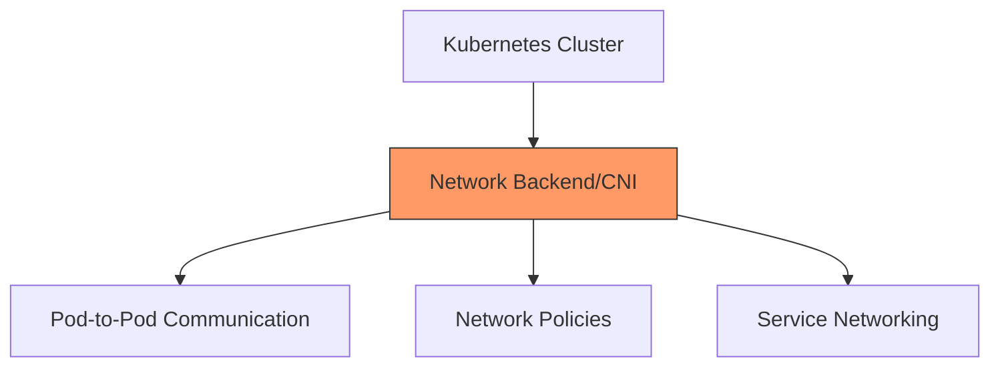

# Understanding Kubernetes Network Backends

## Introduction

Kubernetes networking can be complex, but choosing the right network backend (CNI plugin) is crucial for your cluster's success. This guide helps you understand common networking backends and when to use them.

## Network Backend Basics



### What is CNI?

Container Network Interface (CNI) is a standard that defines how container networking should be configured. Network backends implement this standard to provide:

* Pod-to-pod communication
* Network policy enforcement
* Service networking
* External access

## Common Network Backends

### 1. Flannel: The Simple Solution

!!! tip "Best For"
    * Development environments
    * Small clusters
    * Learning Kubernetes
    * Simple requirements

#### Key Features
* Easy to set up
* Minimal configuration
* Low overhead
* Layer 3 networking

#### Installation
```bash
kubectl apply -f https://raw.githubusercontent.com/flannel-io/flannel/master/Documentation/kube-flannel.yml
```

#### When to Use Flannel
* You're new to Kubernetes
* You need a simple development environment
* Your cluster has basic networking needs
* You want minimal configuration overhead

#### When Not to Use
* You need network policies
* You require advanced security features
* You have performance-critical applications
* You need cross-cluster networking

### 2. Calico: The Production Standard

!!! tip "Best For"
    * Production environments
    * Security-focused deployments
    * Large clusters
    * Multi-tenant environments

#### Key Features
* Network policy support
* BGP routing
* Performance optimized
* Security controls

#### Installation
```bash
kubectl apply -f https://docs.projectcalico.org/manifests/calico.yaml
```

#### When to Use Calico
* You need network policy enforcement
* You want BGP routing capabilities
* You have a large-scale deployment
* You require performance monitoring

#### When Not to Use
* You need a simple setup for development
* You have limited resources
* You don't need advanced networking features

### 3. Cilium: The Modern Choice

!!! tip "Best For"
    * Microservices architectures
    * High-performance requirements
    * Security-critical applications
    * Observability needs

#### Key Features
* eBPF-based networking
* Application-aware policies
* Advanced observability
* Load balancing

#### Installation
```bash
helm repo add cilium https://helm.cilium.io/
helm install cilium cilium/cilium --namespace kube-system
```

#### When to Use Cilium
* You need application-layer visibility
* You want modern security features
* You require high performance
* You need detailed networking metrics

#### When Not to Use
* You have older kernel versions (<4.9)
* You need a simple networking solution
* You have limited system resources

## Choosing the Right Backend

### Decision Matrix

| Requirement | Flannel | Calico | Cilium |
|-------------|---------|---------|---------|
| Ease of Setup | ★★★★★ | ★★★ | ★★ |
| Performance | ★★★ | ★★★★ | ★★★★★ |
| Security Features | ★ | ★★★★ | ★★★★★ |
| Resource Usage | ★★★★★ | ★★★ | ★★ |
| Enterprise Support | ★ | ★★★★★ | ★★★★ |
| Learning Curve | ★★★★★ | ★★★ | ★★ |

### Common Scenarios

#### 1. Development Environment
```yaml
Recommendation: Flannel
Reasons:
- Simple setup
- Minimal resources
- Quick start
- Sufficient for development
```

#### 2. Production Microservices
```yaml
Recommendation: Cilium
Reasons:
- Application-aware policies
- High performance
- Advanced observability
- Modern security features
```

#### 3. Enterprise Cluster
```yaml
Recommendation: Calico
Reasons:
- Proven track record
- Enterprise support
- Network policies
- BGP routing
```

## Network Policy Examples

### Basic Policy with Calico
```yaml
apiVersion: networking.k8s.io/v1
kind: NetworkPolicy
metadata:
  name: allow-frontend
spec:
  podSelector:
    matchLabels:
      app: backend
  ingress:
  - from:
    - podSelector:
        matchLabels:
          app: frontend
    ports:
    - protocol: TCP
      port: 80
```

### Application-Layer Policy with Cilium
```yaml
apiVersion: cilium.io/v2
kind: CiliumNetworkPolicy
metadata:
  name: http-policy
spec:
  endpointSelector:
    matchLabels:
      app: api
  ingress:
  - fromEndpoints:
    - matchLabels:
        app: frontend
    toPorts:
    - ports:
      - port: "80"
        protocol: TCP
      rules:
        http:
        - method: GET
          path: "/api/v1"
```

## Troubleshooting Tips

### 1. Pod Communication Issues
```bash
# Test pod connectivity
kubectl run test-pod --image=busybox -it --rm -- ping <target-pod-ip>

# Check CNI configuration
kubectl get pods -n kube-system | grep cni
```

### 2. Network Policy Problems
```bash
# Verify policy
kubectl describe networkpolicy <policy-name>

# Check CNI logs
kubectl logs -n kube-system -l k8s-app=calico-node  # For Calico
kubectl logs -n kube-system -l k8s-app=cilium  # For Cilium
```

### 3. Performance Issues
```bash
# Check CNI pod status
kubectl get pods -n kube-system -o wide | grep cni

# View metrics (Cilium)
cilium status
```

## Best Practices

### 1. General Guidelines
* Start with Flannel for learning
* Use Calico for standard production workloads
* Choose Cilium for modern microservices

### 2. Production Setup
* Always enable network policies
* Monitor CNI pod health
* Keep CNI version updated
* Document your network architecture

### 3. Resource Planning
* Consider node resources
* Plan IP address ranges
* Account for future growth
* Monitor network performance

## Additional Resources

* [CNI Specification](https://github.com/containernetworking/cni)
* [Flannel Documentation](https://github.com/flannel-io/flannel)
* [Calico Documentation](https://docs.projectcalico.org/)
* [Cilium Documentation](https://docs.cilium.io/)
