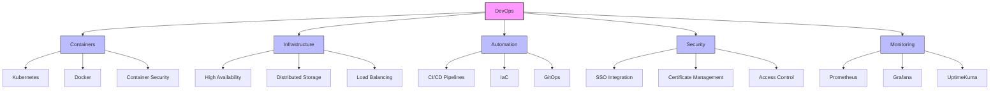

   
DevOps + Linux

# Welcome to My DevOps Journey

!!! info "About Me"
    I'm a DevOps Architect and Systems Administrator based in New Delhi, India, with a strong background in Kubernetes, CI/CD, and infrastructure management. My expertise lies in building and maintaining scalable, secure, and automated cloud-native environments.

## Professional Focus

## Core Competencies

=== "Infrastructure & Orchestration"
    - ⛴️ **Kubernetes Cluster Management**
        - High Availability setups
        - Custom resource management
        - Multi-environment deployments
    - 🔄 **Container Orchestration**
        - Docker containerization
        - Harbor private registry
        - Image security scanning
    - 💾 **Storage Solutions**
        - Distributed storage (Longhorn)
        - HA database clusters
        - Backup management

=== "DevOps & Automation"
    - 🔄 **CI/CD Implementation**
        - GitHub Actions
        - ArgoCD
        - Automated deployments
    - 🛠️ **Infrastructure as Code**
        - Ansible automation
        - Configuration management
        - Version control
    - 🔍 **Monitoring & Logging**
        - Prometheus metrics
        - Grafana dashboards
        - Log aggregation

=== "Security & Networking"
    - 🔒 **Security Management**
        - SSL/TLS implementation
        - SSO integration
        - Access control
    - 🌐 **Network Administration**
        - Traefik ingress control
        - DNS management
        - Cloudflare integration

## Current Projects

!!! example "HomeLab Environment"
    A sophisticated home laboratory environment featuring:
    
    - K3s Kubernetes cluster (1 master, 2 workers)
    - Self-hosted services:
        - Documentation server
        - Nextcloud
        - Bitwarden
        - Jellyfin media server
    - Secured with:
        - Cloudflare tunnels
        - SSO authentication
        - Custom domain management

## Technical Stack

### Primary Technologies

| Category | Technologies |
|----------|-------------|
| **Container Platforms** | Kubernetes, Docker, Proxmox |
| **CI/CD Tools** | GitHub Actions, ArgoCD, Harbor |
| **Infrastructure** | Ansible, Terraform |
| **Databases** | PostgreSQL, MariaDB, Redis |
| **Monitoring** | Grafana, Prometheus, UptimeKuma |
| **Web Servers** | Nginx, Traefik |
| **Programming** | Python, Bash |
| **Version Control** | Git, GitHub |

### Cloud & Hosting Experience

- Digital Ocean
- AWS
- Hetzner
- Traditional hosting (Plesk, cPanel)

## Areas of Interest

I'm particularly passionate about:

- 🏗️ Building scalable infrastructure
- 🔐 Implementing security best practices
- 📚 Documentation and knowledge sharing
- 🤝 Mentoring and team collaboration
- 🔄 Process automation and optimization

## Let's Connect

Feel free to reach out if you want to:

- Discuss DevOps practices
- Collaborate on projects
- Share knowledge and experiences
- Explore infrastructure solutions

You can find my detailed technical documentation under the Documentation section, or connect with me on [LinkedIn](https://www.linkedin.com/in/shashank-bioinformatics).

---

🌐 [darkmode.dev](https://darkmode.dev)
