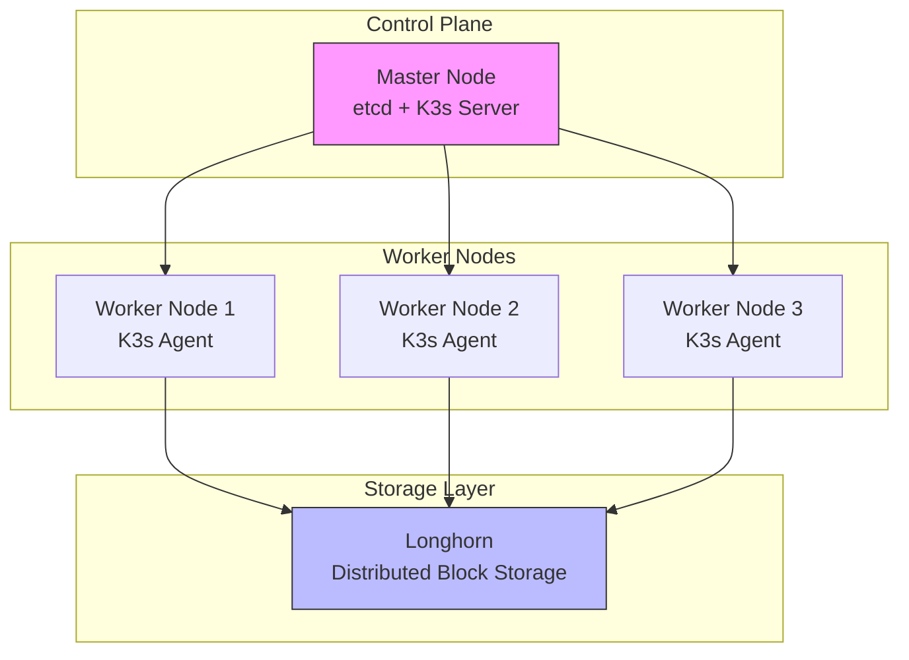

# High Availability K3s Cluster Setup Guide

## Overview

!!! info "Guide Information"
    **Difficulty**: Advanced  
    **Time Required**: ~1 hour  
    **Last Updated**: March 2024  
    **K3s Version**: v1.32.2+k3s1  
    **Longhorn Version**: v1.6.0

## Architecture Overview



## Prerequisites

!!! abstract "System Requirements"
    === "Master Node"
        - 2 CPU cores
        - 4GB RAM
        - 40GB disk space
        - Ubuntu 22.04 LTS
        - Static IP address

    === "Worker Nodes"
        - 2 CPU cores
        - 8GB RAM
        - 100GB disk space
        - Ubuntu 22.04 LTS
        - Static IP addresses

    === "Network Requirements"
        - All nodes must have:
            - Unrestricted connectivity between nodes
            - Internet access for package installation
            - Firewall ports open:
                - TCP/6443 (K3s API)
                - TCP/2379-2380 (etcd)
                - UDP/8472 (VXLAN)
                - TCP/10250 (kubelet)

## Server Preparation

!!! warning "Important"
    Execute these steps on **ALL** nodes unless specified otherwise.

### System Updates

```bash
# Update package list and upgrade system
sudo apt update && sudo apt upgrade -y

# Install required packages
sudo apt install -y \
    curl \
    gnupg \
    nfs-common \
    open-iscsi \
    jq \
    logrotate
```

### Configure Log Rotation

Create a logrotate configuration for K3s:

```bash title="/etc/logrotate.d/k3s" linenums="1"
/var/log/k3s/*.log {
    daily
    rotate 7
    compress
    delaycompress
    missingok
    notifempty
    create 0640 root root
    postrotate
        systemctl restart k3s-server 2>/dev/null || true
        systemctl restart k3s-agent 2>/dev/null || true
    endscript
}
```

### System Configuration

```bash title="System Settings" linenums="1"
# Enable and start open-iscsi for Longhorn
sudo systemctl enable --now iscsid

# Configure sysctl settings
cat << EOF | sudo tee /etc/sysctl.d/k3s.conf
net.bridge.bridge-nf-call-iptables = 1
net.ipv4.ip_forward = 1
vm.max_map_count = 262144
EOF

sudo sysctl --system
```

## K3s Installation

### Master Node Setup

!!! danger "Master Node Only"
    Run these commands **ONLY** on the master node.

```bash title="Install K3s Server"
# Download K3s installation script
curl -sfL https://get.k3s.io > k3s-install.sh

# Install K3s server with HA etcd and VXLAN
sudo INSTALL_K3S_VERSION="v1.33.0+k3s1" bash k3s-install.sh server \
    --cluster-init \
    --flannel-backend=vxlan \
    --disable traefik \
    --disable servicelb \
    --disable local-storage \
    --tls-san $(hostname -f) \
    --write-kubeconfig-mode 644

# Get node token for workers
sudo cat /var/lib/rancher/k3s/server/node-token
```

### Worker Nodes Setup

!!! info "Worker Nodes Only"
    Replace `MASTER_IP` and `NODE_TOKEN` with your actual values.

```bash title="Install K3s Agent"
# Download K3s installation script
curl -sfL https://get.k3s.io > k3s-install.sh

# Install K3s agent
sudo INSTALL_K3S_VERSION="v1.33.0+k3s1" K3S_URL="https://MASTER_IP:6443" \
    K3S_TOKEN="NODE_TOKEN" bash k3s-install.sh agent
```

### Verify Cluster Status

=== "Check Nodes"
    ```bash
    kubectl get nodes -o wide
    ```

=== "Check Pods"
    ```bash
    kubectl get pods -A
    ```

=== "Check etcd Health"
    ```bash
    kubectl -n kube-system exec -it etcd-master -- etcdctl endpoint health
    ```

## Longhorn Installation

### Prerequisites Check

Run this on all nodes to verify Longhorn requirements:

```bash title="Verify Requirements"
curl -sSfL https://raw.githubusercontent.com/longhorn/longhorn/v1.6.0/scripts/environment_check.sh | bash
```

### Install Longhorn

!!! note "Installation Steps"
    Execute these commands on the master node.

```bash title="Deploy Longhorn"
# Add Longhorn Helm repository
helm repo add longhorn https://charts.longhorn.io
helm repo update

# Install Longhorn
helm install longhorn longhorn/longhorn \
    --namespace longhorn-system \
    --create-namespace \
    --version 1.6.0 \
    --set defaultSettings.defaultDataPath="/var/lib/longhorn" \
    --set defaultSettings.guaranteedEngineManagerCPU=5 \
    --set defaultSettings.guaranteedReplicaManagerCPU=5
```

### Verify Longhorn Installation

=== "Check Pods"
    ```bash
    kubectl -n longhorn-system get pods
    ```

=== "Check StorageClass"
    ```bash
    kubectl get sc
    ```

=== "Access Dashboard"
    ```bash
    # Port forward Longhorn UI
    kubectl -n longhorn-system port-forward svc/longhorn-frontend 8000:80
    ```
    Access via: [http://localhost:8000](http://localhost:8000)

## Troubleshooting

### Common Issues

!!! bug "Known Problems and Solutions"

    === "Node Not Ready"
        1. Check K3s service status:
           ```bash
           sudo systemctl status k3s
           ```
        2. View K3s logs:
           ```bash
           sudo journalctl -u k3s
           ```

    === "etcd Issues"
        1. Check etcd cluster health:
           ```bash
           sudo k3s etcd-snapshot ls
           ```
        2. Verify etcd member list:
           ```bash
           kubectl -n kube-system exec -it etcd-master -- etcdctl member list
           ```

    === "Longhorn Volume Issues"
        1. Check volume status:
           ```bash
           kubectl -n longhorn-system get volumes
           ```
        2. View instance manager logs:
           ```bash
           kubectl -n longhorn-system logs -l app=longhorn-manager
           ```

## Maintenance

### Backup Procedures

=== "etcd Backup"
    ```bash
    # Create etcd snapshot
    sudo k3s etcd-snapshot save --name etcd-backup-$(date +%Y%m%d)
    ```

=== "Longhorn Backup"
    ```bash
    # Create backup settings
    kubectl -n longhorn-system apply -f - <<EOF
    apiVersion: longhorn.io/v1beta1
    kind: BackupTarget
    metadata:
      name: default
    spec:
      backupTargetURL: s3://your-bucket-name@region/path
      credentialSecret: aws-secret
    EOF
    ```

### Monitoring Setup

!!! tip "Monitoring Stack"
    Consider installing:
    - Prometheus for metrics collection
    - Grafana for visualization
    - Alertmanager for notifications

## Security Recommendations

1. Network Policies
   ```yaml
   apiVersion: networking.k8s.io/v1
   kind: NetworkPolicy
   metadata:
     name: default-deny-all
   spec:
     podSelector: {}
     policyTypes:
     - Ingress
     - Egress
   ```

2. Pod Security Standards
   ```yaml
   apiVersion: constraints.gatekeeper.sh/v1beta1
   kind: K8sPSPPrivilegedContainer
   metadata:
     name: no-privileged-containers
   spec:
     enforcementAction: deny
   ```

## Next Steps

- [ ] Configure external load balancer
- [ ] Set up monitoring and logging
- [ ] Implement backup strategy
- [ ] Configure disaster recovery
- [ ] Set up CI/CD pipelines

!!! quote "Need Help?"
    If you encounter any issues:
    - Check the [K3s documentation](https://docs.k3s.io/)
    - Visit the [Longhorn documentation](https://longhorn.io/docs/)
    - Join the [K3s Slack channel](https://slack.rancher.io/)
