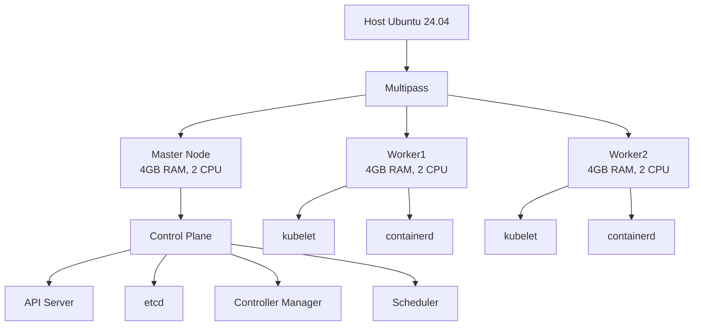

# Local Kubernetes Cluster with Multipass

## Overview

!!! info "Guide Information"
    **Difficulty**: Intermediate  
    **Time Required**: ~30 minutes  
    **Last Updated**: March 2024

## Table of Contents

1. [Setup Multipass](#setup-multipass)
2. [Provision Virtual Machines](#provision-virtual-machines)
3. [Server Preparation](#server-preparation)
4. [Configure System Settings](#configure-system-settings)
5. [Install Kubernetes Components](#install-kubernetes-components)
6. [Initialize Cluster](#initialize-cluster)
7. [Setup Network Interface](#setup-network-interface)
8. [Join Worker Nodes](#join-worker-nodes)
9. [Verify Cluster](#verify-cluster)
10. [Troubleshooting](#troubleshooting)
11. [Cluster Maintenance](#cluster-maintenance)

## Architecture



## Setup Multipass

!!! tip "Quick Setup"
    Multipass provides a fast way to spin up Ubuntu VMs. It's lightweight and perfect for local Kubernetes clusters.

=== "Install Multipass"
    ```bash
    sudo snap install multipass
    ```

=== "Verify Installation"
    ```bash
    multipass version
    ```

=== "List Available Images"
    ```bash
    multipass find
    ```

## Provision Virtual Machines

!!! info "Resource Allocation"
    We'll create one master node and two worker nodes. Adjust the resources based on your system capabilities.

```bash title="Create Cluster Nodes"
# Create master node
multipass launch --name master --cpus 2 --mem 4G --disk 20G 

# Create worker nodes
multipass launch --name worker1 --cpus 2 --mem 4G --disk 20G 
multipass launch --name worker2 --cpus 2 --mem 4G --disk 20G 
```

??? example "Expected Output"
    ```
    Launched: master
    Launched: worker1
    Launched: worker2
    ```

### Access Nodes

=== "Master Node"
    ```bash
    multipass shell master
    ```

=== "Worker Node 1"
    ```bash
    multipass shell worker1
    ```

=== "Worker Node 2"
    ```bash
    multipass shell worker2
    ```

### Get Node IPs

```bash
multipass list
```

## Server Preparation

!!! warning "Important"
    Run these commands on **ALL** nodes (master and workers).

=== "Update System"
    ```bash
    sudo apt update && sudo apt upgrade -y
    ```

=== "Install Dependencies"
    ```bash
    sudo apt install -y apt-transport-https ca-certificates curl gnupg lsb-release
    ```

=== "Setup Docker Repository"
    ```bash
    sudo mkdir -p /etc/apt/keyrings
    curl -fsSL https://download.docker.com/linux/ubuntu/gpg | sudo tee /etc/apt/keyrings/docker.asc > /dev/null
    echo "deb [arch=$(dpkg --print-architecture) signed-by=/etc/apt/keyrings/docker.asc] https://download.docker.com/linux/ubuntu $(lsb_release -cs) stable" | sudo tee /etc/apt/sources.list.d/docker.list > /dev/null
    ```

### Install Containerd

```bash title="Install and Configure Containerd" linenums="1"
# Install containerd
sudo apt update
sudo apt install -y containerd.io

# Enable and start containerd
sudo systemctl enable containerd
sudo systemctl start containerd

# Generate default config
sudo mkdir -p /etc/containerd
containerd config default | sudo tee /etc/containerd/config.toml

# Modify containerd configuration
sudo sed -i 's/SystemdCgroup = false/SystemdCgroup = true/' /etc/containerd/config.toml
sudo sed -i 's/^disabled_plugins = \["cri"\]/#disabled_plugins = \["cri"\]/' /etc/containerd/config.toml

# Restart containerd
sudo systemctl restart containerd
```

## Configure System Settings

!!! danger "Critical Step"
    Skipping these configurations may result in cluster initialization failures.

=== "Disable Swap"
    ```bash
    sudo swapoff -a
    sudo sed -i '/swap/d' /etc/fstab
    ```

=== "Load Kernel Modules"
    ```bash
    cat <<EOF | sudo tee /etc/modules-load.d/k8s.conf
    overlay
    br_netfilter
    EOF

    sudo modprobe overlay
    sudo modprobe br_netfilter
    ```

=== "Configure Sysctl"
    ```bash
    cat <<EOF | sudo tee /etc/sysctl.d/k8s.conf
    net.bridge.bridge-nf-call-iptables  = 1
    net.bridge.bridge-nf-call-ip6tables = 1
    net.ipv4.ip_forward                 = 1
    EOF

    sudo sysctl --system
    ```

## Install Kubernetes Components

!!! note "Version Information"
    This guide uses Kubernetes v1.32. Adjust version numbers as needed.

```bash title="Install Kubernetes Tools" hl_lines="1 2"
# Add Kubernetes repository
curl -fsSL https://pkgs.k8s.io/core:/stable:/v1.32/deb/Release.key | sudo gpg --dearmor -o /etc/apt/keyrings/kubernetes-apt-keyring.gpg

echo 'deb [signed-by=/etc/apt/keyrings/kubernetes-apt-keyring.gpg] https://pkgs.k8s.io/core:/stable:/v1.32/deb/ /' | sudo tee /etc/apt/sources.list.d/kubernetes.list

# Install required packages
sudo apt update
sudo apt install -y kubelet kubeadm kubectl

# Prevent accidental upgrades
sudo apt-mark hold kubelet kubeadm kubectl

# Enable kubelet
sudo systemctl enable kubelet
sudo systemctl start kubelet
```

## Initialize Cluster

!!! warning "Master Node Only"
    Run these commands **ONLY** on the master node.

```bash title="Initialize Kubernetes Cluster"
# Initialize cluster
sudo kubeadm init --pod-network-cidr=10.244.0.0/16

# Setup kubeconfig
mkdir -p $HOME/.kube
sudo cp -i /etc/kubernetes/admin.conf $HOME/.kube/config
sudo chown $(id -u):$(id -g) $HOME/.kube/config
```

??? tip "Save the Join Command"
    The initialization will output a `kubeadm join` command. Save this for joining worker nodes.

## Setup Network Interface

=== "Install Flannel CNI"
    ```bash
    kubectl apply -f https://github.com/flannel-io/flannel/releases/latest/download/kube-flannel.yml
    ```

=== "Verify Installation"
    ```bash
    kubectl get pods -n kube-flannel
    ```

## Join Worker Nodes

!!! info "Worker Nodes Only"
    Run these commands on each worker node.

=== "Get Join Command (Master)"
    ```bash
    kubeadm token create --print-join-command
    ```

=== "Join Cluster (Workers)"
    ```bash
    sudo kubeadm join <master-ip>:6443 --token <token> --discovery-token-ca-cert-hash sha256:<hash>
    ```

## Verify Cluster

=== "Check Node Status"
    ```bash
    kubectl get nodes
    ```

=== "Check Pods"
    ```bash
    kubectl get pods -A
    ```

## Troubleshooting

!!! bug "Common Issues"

    === "Node Not Ready"
        1. Check CNI pods: `kubectl get pods -n kube-system`
        2. Check kubelet status: `systemctl status kubelet`
        3. View kubelet logs: `journalctl -xeu kubelet`

    === "Join Command Issues"
        1. Generate new token: `kubeadm token create`
        2. Get discovery token CA cert hash:
           ```bash
           openssl x509 -pubkey -in /etc/kubernetes/pki/ca.crt | \
           openssl rsa -pubin -outform der 2>/dev/null | \
           openssl dgst -sha256 -hex | sed 's/^.* //'
           ```

    === "Pod Network Issues"
        1. Check flannel pods: `kubectl get pods -n kube-flannel`
        2. Check flannel logs: `kubectl logs -n kube-flannel <pod-name>`

## Cluster Maintenance

### Backup Procedures

!!! example "Backup etcd"
    ```bash
    sudo apt install etcd-client
    ETCDCTL_API=3 etcdctl --endpoints=https://127.0.0.1:2379 \
    --cacert=/etc/kubernetes/pki/etcd/ca.crt \
    --cert=/etc/kubernetes/pki/etcd/server.crt \
    --key=/etc/kubernetes/pki/etcd/server.key \
    snapshot save snapshot.db
    ```

### Scaling the Cluster

To add more worker nodes:

1. Create new VM using multipass
2. Follow server preparation steps
3. Join the cluster using the join command

### Cleanup

=== "Delete Node"
    ```bash
    # On master node
    kubectl drain <node-name> --ignore-daemonsets
    kubectl delete node <node-name>
    
    # On worker node
    sudo kubeadm reset
    ```

=== "Delete VM"
    ```bash
    multipass delete <vm-name>
    multipass purge
    ```

### Security Best Practices

1. Keep Kubernetes version updated
2. Use Network Policies
3. Enable RBAC
4. Regularly rotate certificates
5. Monitor cluster with security tools

## Next Steps

- Deploy sample applications
- Setup monitoring with Prometheus and Grafana
- Configure persistent storage
- Implement high availability

!!! quote "Need Help?"
    If you encounter any issues, check the [official Kubernetes documentation](https://kubernetes.io/docs/) or open an issue in the repository.
